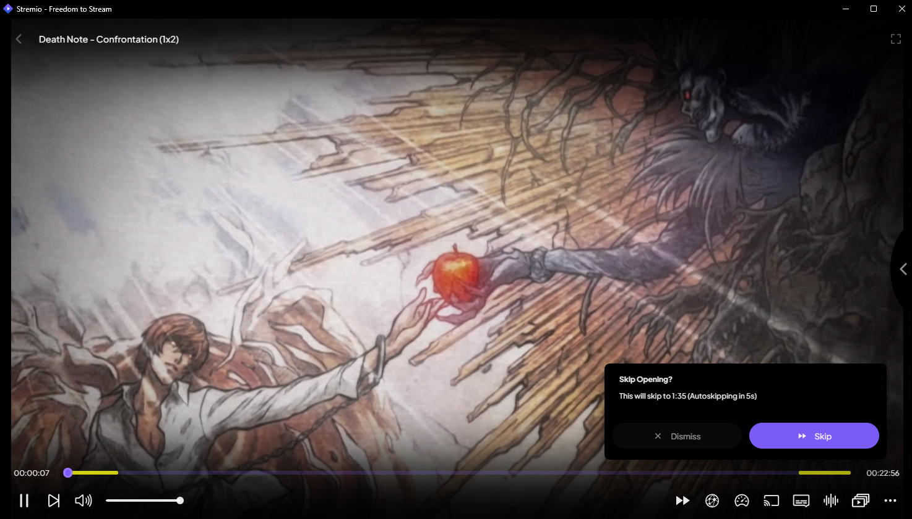
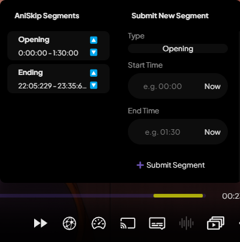
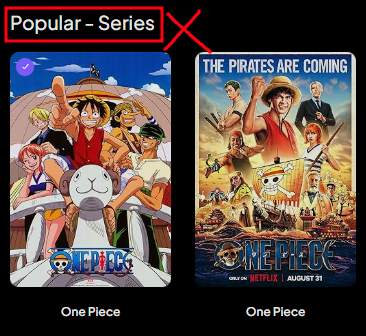
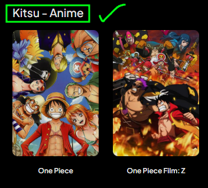

	
	<h1 align="center">Stremio AniSkip</h1>
	

		
		
		
		 
		
		
		
	

## ❓ What is Stremio AniSkip?
This project is a plugin for [Stremio Enhanced](https://github.com/REVENGE977/stremio-enhanced). It integrates the [AniSkip API](https://api.aniskip.com/api-docs) into Stremio to automatically skip anime openings/endings. 

**This is an early version so you might encounter bugs.**

It will highlight the skip segments in yellow and when the timestamp for them is reached, it will prompt you to skip or dismiss. It will automatically skip in 5 seconds if no option is chosen by the user.

Here you can submit new vote segments or submit new ones. You can access this menu by pressing the skip icon.
You can press "Now" to automatically enter the current timestamp.

<b>NOTE:</b> Currently, when you submit a new skip segment, you have to leave the stream you're watching and go back in to see the changes. This will change in an update coming later.

## 🛠 How does it work?

This plugin uses the [Jikan API](https://jikan.moe/) to find the MyAnimeList ID for the anime you're watching. It then uses that ID to fetch any available skip segments from the [AniSkip API](https://api.aniskip.com/api-docs), since AniSkip relies on MyAnimeList IDs.

### Why only Kitsu is supported (for now)

Currently, this plugin only works with **Kitsu** titles. That might change later, but for now it’s intentional. Here’s why:

Stremio’s regular IMDb-based metaitems usually bundle **all seasons of a show under a single title**. This causes problems when trying to match a specific season or arc to its correct MyAnimeList ID—especially for anime where each season has a unique name that doesn't clearly say "Season 2" or "Part 3" (e.g., Re:Zero, Monogatari, etc.).

Additionally, IMDb metaitems often **split episodes into seasons** even when MyAnimeList doesn't (e.g., One Piece episode 300 shows up as Season 11, Episode 74 on Stremio, but it's just Episode 300 on MAL).

These inconsistencies make it unreliable to fetch MyAnimeList to find the ID of the anime you're watching, which is why Kitsu is relied on. It categorizes anime exactly like MyAnimeList with the same episode listing and naming structure.

### TL;DR

**Just use the Kitsu addon.**  
[Install it from here](https://www.stremio-addons.com/anime-kitsu.html) and always select the **Kitsu metaitem** when watching anime.

  

    
    
IMDb metaitem <b>(not supported)</b>

  

  

    
    
Kitsu metaitem <b>(supported)</b>

  

## 📥 Downloads
You can download the latest version from [releases](https://github.com/REVENGE977/stremio-aniskip/releases) 
or directly download from the [dist folder](https://github.com/REVENGE977/stremio-aniskip/blob/main/dist/AniSkip.plugin.js).

## 🚨 Important Notice
**This project is not affiliated in any way with Stremio or AniSkip.**